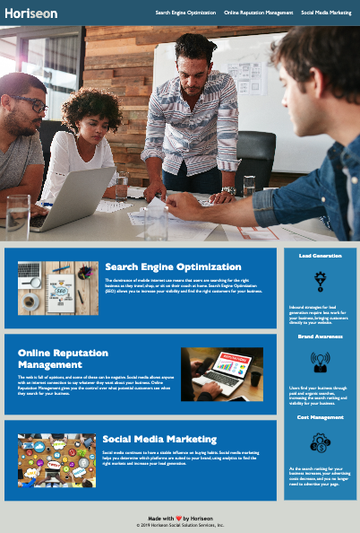

# Challenge1

## Description 

Horiseon social solution Services, Inc seeks to improve their website codebase to make it more user friendly, pursuing search engine optimization.

The following improvements have been made in order to accomplish the desired outcome:

- Metadata elements have been added to the /head/ section with the aim of making the data easier to find, understand, and manage on web-browsers.

- The HTML and CSS selectors and properties have been organized according to a semantic structure.

- HTML and CSS comments have been added to specify different sections and functions of the website.

- Testing the functionality of links on the website to ensure they function as intended

- Alt attribute added to replace non-displayed images with text

## Usage 

https://nazaretrueda.github.io/challenge1/starter/index.html

## Credits

https://www.w3schools.com/tags/tag_meta.asp

https://www.w3schools.com/html/html5_semantic_elements.asp

https://www.semrush.com/blog/semantic-html5-guide/

https://www.w3schools.com/tags/att_img_alt.asp

https://www.w3schools.com/css/css_comments.asp

## License

MIT License

Copyright (c) 2023 Naz

Permission is hereby granted, free of charge, to any person obtaining a copy
of this software and associated documentation files (the "Software"), to deal
in the Software without restriction, including without limitation the rights
to use, copy, modify, merge, publish, distribute, sublicense, and/or sell
copies of the Software, and to permit persons to whom the Software is
furnished to do so, subject to the following conditions:

The above copyright notice and this permission notice shall be included in all
copies or substantial portions of the Software.

THE SOFTWARE IS PROVIDED "AS IS", WITHOUT WARRANTY OF ANY KIND, EXPRESS OR
IMPLIED, INCLUDING BUT NOT LIMITED TO THE WARRANTIES OF MERCHANTABILITY,
FITNESS FOR A PARTICULAR PURPOSE AND NONINFRINGEMENT. IN NO EVENT SHALL THE
AUTHORS OR COPYRIGHT HOLDERS BE LIABLE FOR ANY CLAIM, DAMAGES OR OTHER
LIABILITY, WHETHER IN AN ACTION OF CONTRACT, TORT OR OTHERWISE, ARISING FROM,
OUT OF OR IN CONNECTION WITH THE SOFTWARE OR THE USE OR OTHER DEALINGS IN THE
SOFTWARE.

